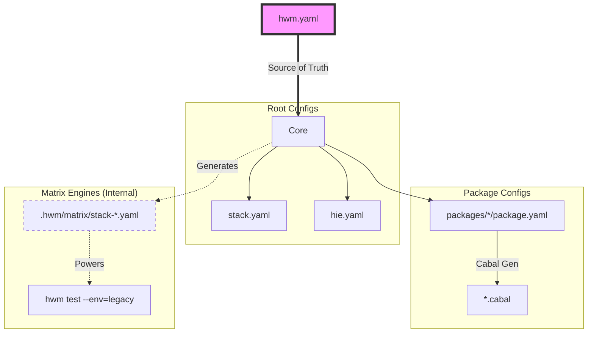

# HWM: Haskell Workspace Manager

> **Infrastructure-as-Code for your Haskell Workspaces.**

**HWM is not a build tool replacement.** It is the missing link that orchestrates the tools you already rely on (`stack`, `cabal`, `hls`), transforming them into a unified, declarative pipeline.

**Think of HWM as Terraform for your local Haskell repository.** Whether you are managing a single open-source library or a multi-package enterprise workspace, HWM ensures the state of your project files matches your declared intent across all environments.

HWM is an **active workspace maintainer** that helps you:

* **Manage & Validate:** Auto-generate and sync the configuration files your toolchain expects (`stack.yaml`, `package.yaml`, `hie.yaml`).
* **Smart Bounds Discovery:** Automatically calculate safe dependency bounds derived directly from your successful matrix builds.
* **Test Locally:** Run comprehensive matrix tests across multiple GHC versions right on your machine.
* **Release & Publish:** Streamline versioning, binary artifact generation, and Hackage publishing via declarative **Release Trains**.

---

### 💡 The Motivation: Streamlining Haskell Development

Haskell tooling is incredibly powerful. HWM was designed to help you scale that tooling effortlessly as your project grows:

1. **The "Sandwich" Bounds Logic:** HWM determines the safest version bounds by auditing your `legacy` (minimum) and `nightly` (maximum) snapshots. It effectively "sandwiches" your code between the oldest and newest supported environments to determine compatibility.
2. **Seamless HLS Integration:** Adding a package or moving a module automatically updates your `hie.yaml`, keeping your Haskell Language Server responsive and accurate.
3. **Unified Dependency Management:** HWM acts as a centralized registry for your workspace, ensuring perfect alignment across all packages.
4. **Native Artifact Distribution:** HWM replaces custom deployment scripts with a clean, declarative pipeline for compressing and hashing binary artifacts.

### ✅ The Solution: A Single Source of Truth

Define your workspace architecture in a single file: `hwm.yaml`.
HWM handles the implementation details by generating the configuration files your standard tools expect.

<p align="center">

</p>


## 🧠 The Brain: Smart Bounds Discovery

The core innovation of HWM is its ability to turn **Matrix Builds** into **Cabal Bounds**.

When you run `hwm registry audit --fix`, HWM doesn't just guess versions; it performs a multi-step verification:

1. It looks at your `legacy` environment to find the **lower bound**.
2. It looks at your `stable` or `nightly` environment to find the **upper bound**.
3. It validates that your code actually compiles in both.
4. It updates `hwm.yaml` with the "Tested Truth."


## 🧩 The "Missing Link" Architecture

HWM sits one layer above your toolchain, acting as the orchestrator for your project.



* **You write:** `hwm.yaml` (1 file).
* **HWM generates:** `stack.yaml`, `package.yaml`, `.cabal`, `hie.yaml`.
* **You run:** Standard `stack` commands or **HWM shortcuts** like `hwm build`.

---

## 🟢 Quick Start

### Installation

```bash
stack install hwm
# or
cabal install hwm

```

### Zero-Config Onboarding

Already have a Stack project? Convert it into an HWM workspace in seconds.

```bash
# 1. Generate hwm.yaml from your existing stack.yaml
# HWM automatically discovers packages and infers dependencies
hwm init

# 2. Sync configuration and build
hwm sync
hwm build # Shortcut for 'hwm run build'

```

<p align="center">

</p>

## 🧪 Proven in Production

HWM was created to solve the orchestration needs of the **[Morpheus GraphQL](https://github.com/morpheusgraphql/morpheus-graphql)** ecosystem.

Today, it powers the entire Morpheus repository, smoothly managing:

* **15+ Packages:** Synchronizing `core`, `api`, and `client` packages.
* **Hybrid Matrices:** Testing `stable` (GHC 9.6) and `legacy` (GHC 8.10) environments side-by-side.
* **Unified Registry:** Maintaining a single source of truth for version bounds across the repository.

> **💡 Tip:** View the [live configuration here](https://github.com/morpheusgraphql/morpheus-graphql/blob/main/hwm.yaml) to see a full-scale example of HWM in action.


---

## 🛠️ Key Workflows

### 1. Registry & Dependency Management

The `registry` in `hwm.yaml` centralizes version bounds for your workspace.

**Smart Add:**
`hwm registry add` uses the "Sandwich" logic to find the safest bounds by auditing your min/max snapshots.

```bash
# Add to a specific package
hwm registry add aeson libs/core

# Add to an entire group (all packages in the 'libs' directory)
hwm registry add servant libs
```

**Audit & Fix:**

Audit your bounds against actual Stackage snapshots to ensure you only claim support for versions validated by your build matrix.

```bash
# Auto-update bounds in hwm.yaml to match tested snapshots
hwm registry audit --fix

```

<p align="center">

</p>

### 2. Workspace Scaffolding

HWM allows you to scaffold new packages natively and instantly wire them into your global configuration.

```bash
# Interactively or directly scaffold a new package in a specific group
hwm workspace add libs/core

```

<p align="center">

</p>

### 3. Matrix & Environment Management

Bring the power of CI matrices to your local development environment.

**Define Environments:**

```yaml
environments:
  default: stable
  targets:
    stable:
      ghc: 9.6.3
      resolver: lts-22.6
    legacy:
      ghc: 8.10.7
      resolver: lts-18.10

```

**Run Your Matrix Locally:**

```bash
# Test across all defined environments (Stable, Legacy, etc.)
hwm test --env=all

```

<p align="center">

</p>

### 4. Release & Distribution (v0.1.0)

HWM introduces **Release Trains**, decoupling your workspace structure from your distribution strategy.

#### 📦 Artifact Pipeline

The `artifacts` pipeline transforms raw binaries into hashed, compressed distribution units.

```yaml
release:
  artifacts:
    # Format: [artifact-name]: [workspace-ref]:[executable-name]
    hwm: libs/hwm:hwm
    # Custom target with specific formats and naming
    daemon:
      source: apps/daemon:hwm-daemon
      formats: [zip, tar.gz]
      ghc-options: -O2
      name-template: "{{binary}}-v{{version}}-{{os}}-{{arch}}"

```

#### 🚢 Publication Trains

Define groups of packages to be published together, allowing you to manage "core" and "plugin" releases separately.

```yaml
release:
  publish:
    main:
      - libs/core # Specific member
      - apps      # Entire workspace group

```

**Usage:**

```bash
# Bump version across the workspace
hwm version minor

# Build local binaries and hashes, (or use --gh-upload to directly upload to GitHub Releases)
hwm release artifacts --gh-upload <github-upload-url>

# Push a specific train to Hackage
hwm release publish main

```

## ⚖️ The Haskell Tooling Landscape

| Feature | Standard Setup | Nix / Bazel | 🚀 HWM |
| --- | --- | --- | --- |
| **Config Source** | Decentralized | Centralized | **Centralized (`hwm.yaml`)** |
| **Bound Management** | Manual Trial/Error | Fixed Hashes | **✅ Smart Bounds Discovery** |
| **Workspace Addition** | Manual Edits | Manual Edits | **✅ Auto-Discovery & Wiring** |
| **Release Pipelines** | Manual Scripts | Custom Scripts | **✅ Declarative Release Trains** |

## 🔮 Roadmap

HWM is actively evolving. While the core Workspace and Matrix engines are stable, we are actively developing the following operational features:

The following operational features are under active development:
* **Professional Distribution (v0.1.0):** Automated Homebrew Formula generation and universal installers (`.deb`, `.rpm`).
* **Deep Nix Integration:** Generating `flake.nix` directly from `hwm.yaml`.
* **Smart Registry Pruning:** Automated detection of unused imports and missing `extra-deps`.


## 🧬 Status

HWM is currently in **v0.1.0 (Beta)**. Your feedback is highly valued! Please [open an issue](https://github.com/nalchevanidze/hwm/issues) if you encounter bugs or want to share how you are using HWM.
