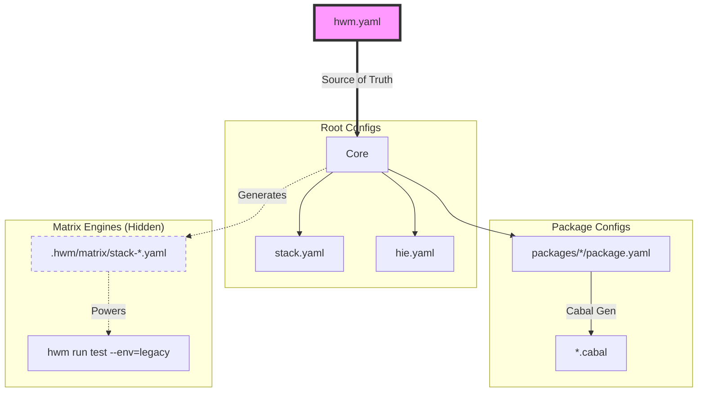

# HWM: Haskell Workspace Manager

> **Infrastructure-as-Code for your Haskell Monorepo.**

**HWM is not a build tool.** It is the missing link that orchestrates the tools you already use (`stack`, `cabal`, `hls`).

**Think of HWM as Terraform for your local repository.**
It ensures the state of your project files matches your declared intent across all packages and environments.

But HWM is not just a static generator—it is an **active workspace maintainer** that helps you:
* **Manage & Validate:** Add, remove, and analyze files to ensure structural consistency.
* **Derive & Verify:** Automatically calculate safe dependency bounds verified against your build matrix.
* **Release & Publish:** Manage atomic releases and synchronized publishing with `relasy` integration.
* **Prune & Optimize:** Detect unused dependencies and keep your project healthy.

[](https://github.com/nalchevanidze/hwm)
[](LICENSE)
[](https://github.com/morpheusgraphql/morpheus-graphql)

---

### 🛑 The Problem
In a typical Haskell monorepo, maintaining consistency is a full-time job:
1.  **Dependency Drift:** "Why does `core` use `aeson-2.0` but `api` uses `aeson-1.5`?"
2.  **Matrix Complexity:** Testing GHC 9.6 (Stable) and 8.10 (Legacy) requires maintaining multiple fragile `stack.yaml` files.
3.  **Broken IDEs:** Adding a module often breaks HLS until you manually update a complex `hie.yaml`.
4.  **CI Hell:** You only find out your bounds are wrong after waiting 15 minutes for GitHub Actions to fail.

### ✅ The Solution
You define the **"what"** (structure, bounds, matrix) in a single file: `hwm.yaml`.
HWM handles the **"how"** by generating the 30+ config files your tools expect.

<p align="center">
  
</p>

---

## 🧩 The "Missing Link" Architecture

HWM sits one layer above your toolchain. It acts as the **Single Source of Truth**.



* **You write:** `hwm.yaml` (1 file).
* **HWM generates:** `stack.yaml`, `package.yaml`, `.cabal`, `hie.yaml` (The noise you shouldn't have to manage).
* **You run:** Standard `stack` or `cabal` commands (or use `hwm run` wrappers).

---

## 🟢 Quick Start

### Installation

```bash
stack install hwm
# or
cabal install hwm

```

### Zero-Config Onboarding

Already have a Stack project? Transform it into an HWM workspace in seconds.

```bash
# 1. Generate hwm.yaml from your existing stack.yaml
# HWM automatically discovers packages and infers dependencies
hwm init

# 2. Sync configuration and build
hwm sync
hwm run build

```

<p align="center">

</p>

---

## 🧪 Born from Necessity

HWM wasn't built in a vacuum. It was created to solve the massive orchestration headaches of the **[Morpheus GraphQL](https://github.com/morpheusgraphql/morpheus-graphql)** ecosystem.

Today, it powers the entire Morpheus monorepo, managing:

* **15+ Packages:** Keeping `core`, `api`, and `client` in sync without version drift.
* **Hybrid Matrix:** Simultaneously testing `stable` (GHC 9.6) and `legacy` (GHC 8.10) environments.
* **Unified Registry:** A single source of truth for version bounds across the entire repository.

> **Tip:** You can view the [live configuration here](https://github.com/morpheusgraphql/morpheus-graphql/blob/main/hwm.yaml) to see a full-scale example of HWM in action.

---

## 🛠️ Key Workflows

### 1. Registry & Dependency Management

Stop guessing version bounds. The `registry` in `hwm.yaml` is the central source of truth for all packages.

**Smart Add:**
`hwm registry add` uses a "Sandwich" discovery logic to find the safest bounds by auditing your `legacy` (min) and `nightly` (max) snapshots.

```bash
# Add to a specific package
hwm registry add aeson libs/core

# Add to an entire group (all packages in 'libs')
hwm registry add servant libs

```

**Audit & Fix:**
Audit your bounds against **real** Stackage snapshots. Ensure you only claim support for versions you actually test.

```bash
# Auto-update bounds in hwm.yaml to match tested snapshots
hwm registry audit --fix

```

<p align="center">

</p>

### 2. Local Matrix Strategy

In most projects, the Build Matrix only exists in the cloud (`.github/workflows`). HWM brings that matrix down to your machine.

**The HWM Way:** Run your entire matrix locally. Catch failures on "Legacy GHC" before you push.

```bash
# Test across all defined environments (Stable, Nightly, Legacy)
hwm run test --env=all

```

<p align="center">

</p>

### 3. Environment Management

Manage multiple GHC versions and resolvers effortlessly.

```yaml
# hwm.yaml
matrix:
  default-environment: stable
  environments:
    - { name: stable, ghc: 9.6.3, resolver: lts-22.6 }
    - { name: nightly, ghc: 9.10.1, resolver: nightly-2024-05-22 }

```

* **Add:** `hwm environment add stable lts-24.25` (Validates against Stackage).
* **Switch:** `hwm environment set-default stable`.
* **List:** `hwm environment ls`.

---

## 🤖 Built for the AI Era

HWM transforms your monorepo into a format LLMs can actually understand.

* **Context Window Friendly:** Instead of pasting 20+ `.cabal` files to give an AI context, paste one `hwm.yaml`.
* **Safe Refactoring:** Ask your AI agent to *"Upgrade dependencies to GHC 9.10"* by editing the `matrix` in `hwm.yaml`. HWM handles the dangerous work of propagating those changes to 50+ files deterministically.

---

## ⚖️ Comparison

Most Haskell teams are stuck between "Manual Chaos" and "Nix Overkill." HWM provides a middle ground.

| Feature | 🐢 Manual Config | ❄️ Nix / Bazel | 🚀 HWM |
| --- | --- | --- | --- |
| **Config Source** | Decentralized (30+ files) | Centralized (`flake.nix`) | **Centralized (`hwm.yaml`)** |
| **Primary Role** | Build Tool | Build & Deployment | **Workspace Manager** |
| **Smart Add** | ❌ Manual Search | ❌ Manual Edit | **✅ `hwm add` (Auto-Discovery)** |
| **Atomic Versioning** | ❌ Manual (File by file) | ❌ Manual | **✅ One Command (`hwm version`)** |
| **Bounds Auditing** | ❌ Manual (Error-prone) | ⚠️ Pinned (Lockfile) | **✅ Real-time Snapshot Audit** |
| **IDE Support** | ⚠️ Often Broken | ⚠️ Requires Plugins | **✅ Auto-Generated (`hie.yaml`)** |

---

## 📚 Documentation

* **[Feature Specification](docs/spec.md)** – Public API & `hwm.yaml` schema.
* **[Architecture](docs/architecture.md)** – Internal design & data flow.
* **[Roadmap](docs/roadmap.md)** – Future plans.

---

## 🧬 Status

HWM is currently in **Alpha**. We value your feedback—please [open an issue](https://github.com/nalchevanidze/hwm/issues) if you encounter bugs or have feature suggestions.
