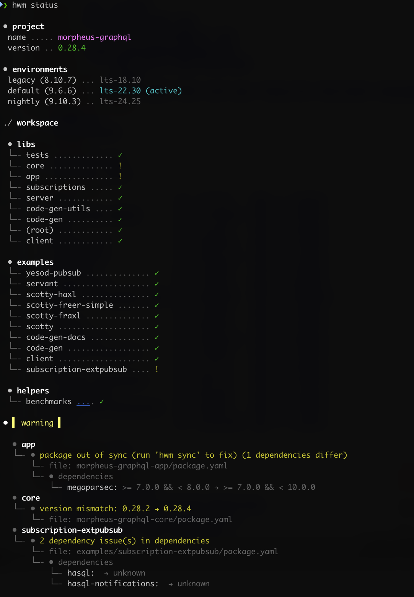
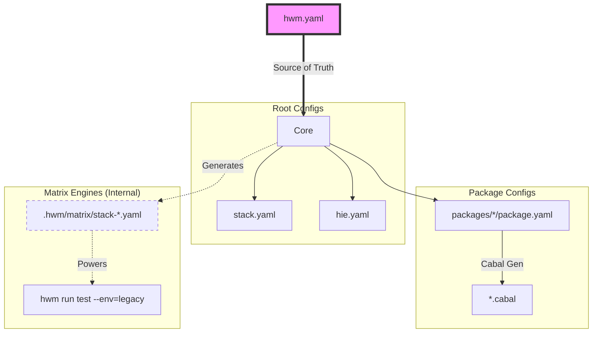
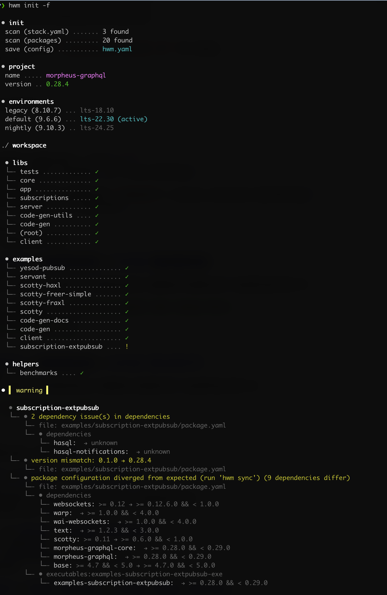
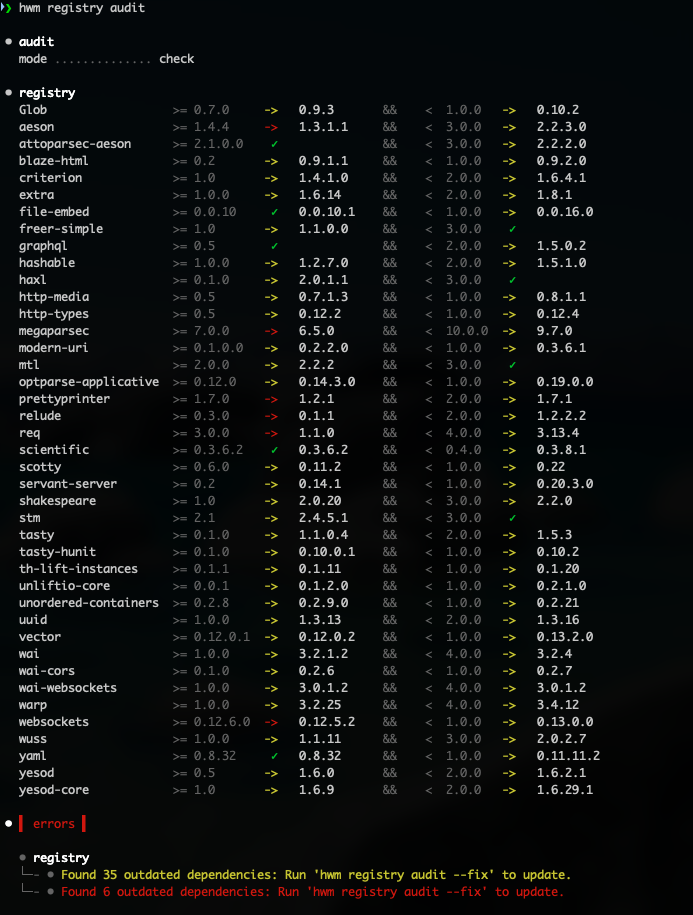
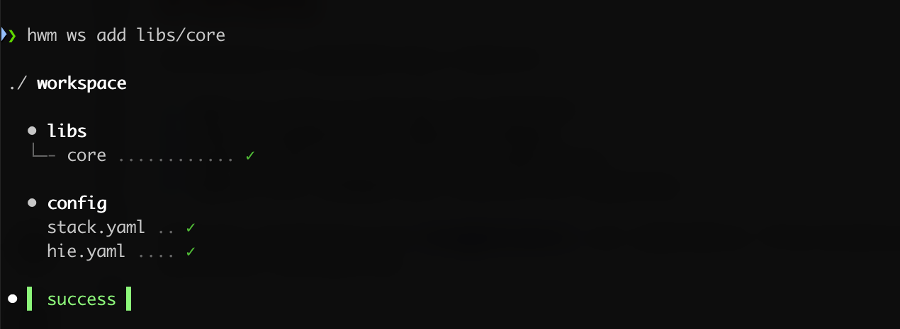
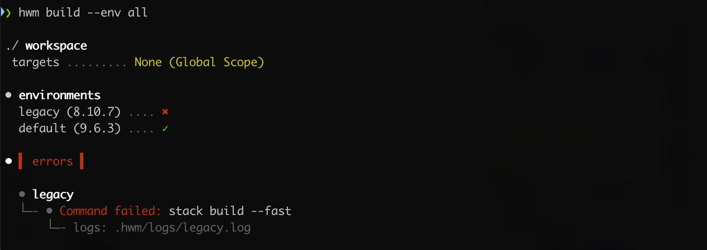

# HWM: Haskell Workspace Manager

> **Infrastructure-as-Code for your Haskell Workspaces.**

**HWM is not a replacement build tool.** It is the missing link that orchestrates the tools you already use (`stack`, `cabal`, `hls`), transforming them into a unified, declarative pipeline.

**Think of HWM as Terraform for your local repository.** Whether you are managing a single open-source library or a 20-package enterprise monorepo, HWM ensures the state of your project files matches your declared intent across all environments.

HWM is an **active workspace maintainer** that helps you:

* **Manage & Validate:** Auto-generate and sync the boilerplate your toolchain expects (`stack.yaml`, `package.yaml`, `hie.yaml`).
* **Derive & Verify:** Automatically calculate safe dependency bounds derived directly from your build matrix.
* **Test Locally:** Run complex matrix tests locally across multiple GHC versions without relying on slow CI runners.
* **Release & Publish:** Fully automate versioning, binary artifact generation, and Hackage publishing via simple workflow triggers.

---

### 🛑 The Problem: Configuration Fatigue

Haskell tooling is powerful, but configuring it for a production-grade lifecycle is exhausting. As your project grows, the boilerplate multiplies:

1. **The HLS Nightmare:** Adding a package or moving a module often breaks the Haskell Language Server, requiring manual, tedious updates to a complex `hie.yaml`.
2. **Matrix Complexity & Lost Bounds:** Testing against multiple GHC versions (e.g., Stable 9.6 and Legacy 8.10) usually means juggling fragile `stack-*.yaml` files or relying entirely on slow GitHub Actions. Worse, that compatibility data is lost at the end of the pipeline—you still have to manually guess and update your dependency bounds instead of deriving them automatically from your successful matrix runs.
3. **Dependency Drift:** In multi-package setups, it's nearly impossible to manually ensure `core` and `api` are using the exact same version of `aeson` without centralized bounds.
4. **Distribution Chaos:** Writing custom bash scripts to compress, name, and hash binary artifacts for GitHub Releases is an error-prone chore.

### ✅ The Solution: A Single Source of Truth

You define the **"what"** (structure, bounds, matrix) in a single file: `hwm.yaml`.
HWM handles the **"how"** by generating the 30+ config files your tools expect and orchestrating your workflows.

<p align="center">

</p>

---

## 🧩 The "Missing Link" Architecture

HWM sits one layer above your toolchain, acting as your workspace's **Single Source of Truth**.



* **You write:** `hwm.yaml` (1 file).
* **HWM generates:** `stack.yaml`, `package.yaml`, `.cabal`, `hie.yaml` (The noise you shouldn't have to manage).
* **You run:** Standard `stack` or `cabal` commands (or use `hwm run` wrappers).

---

## 🟢 Quick Start

### Installation

```bash
stack install hwm
# or
cabal install hwm

```

### Zero-Config Onboarding

Already have a Stack project? Transform it into an HWM workspace in seconds.

```bash
# 1. Generate hwm.yaml from your existing stack.yaml
# HWM automatically discovers packages and infers dependencies
hwm init

# 2. Sync configuration and build
hwm sync
hwm run build

```

<p align="center">

</p>

## 🧪 Born from Necessity

HWM was not built in a vacuum. It was created to solve the massive orchestration headaches of the **[Morpheus GraphQL](https://github.com/morpheusgraphql/morpheus-graphql)** ecosystem.

Today, it powers the entire Morpheus repository, seamlessly managing:

* **15+ Packages:** Keeping `core`, `api`, and `client` in sync without version drift.
* **Hybrid Matrix:** Simultaneously testing `stable` (GHC 9.6) and `legacy` (GHC 8.10) environments.
* **Unified Registry:** A single source of truth for version bounds across the entire repository.

> **💡 Tip:** View the [live configuration here](https://github.com/morpheusgraphql/morpheus-graphql/blob/main/hwm.yaml) to see a full-scale example of HWM in production.

---

## 🛠️ Key Workflows

### 1. Registry & Dependency Management

Stop guessing version bounds. The `registry` in `hwm.yaml` is the central source of truth for your workspace.

**Smart Add:**
`hwm registry add` uses "Sandwich" discovery logic to find the safest bounds by auditing your `legacy` (min) and `nightly` (max) snapshots.

```bash
# Add to a specific package
hwm registry add aeson libs/core

# Add to an entire group (all packages in the 'libs' directory)
hwm registry add servant libs
```

**Audit & Fix:**
Audit your bounds against **real** Stackage snapshots. Ensure you only claim support for versions you actually test.

```bash
# Auto-update bounds in hwm.yaml to match tested snapshots
hwm registry audit --fix

```

<p align="center">

</p>

### 2. Workspace Scaffolding

Stop manually creating folders, copying `package.yaml` files, and breaking your LSP. HWM scaffolds new packages natively and instantly wires them into your global configuration.

```bash
# Interactively or directly scaffold a new package in a specific group
hwm workspace add libs/core

```

<p align="center">

</p>

**What HWM does instantly:**

* Natively generates the package directory and `package.yaml`.
* Registers the new package under the correct group in `hwm.yaml`.
* Automatically wires the package into `stack.yaml` so it builds immediately.
* Automatically injects the package into `hie.yaml`.

### 3. Matrix & Environment Management

In most projects, the Build Matrix only exists in the cloud (`.github/workflows`). HWM brings that matrix down to your machine, letting you manage multiple GHC versions and resolvers effortlessly.

**Define Environments:**

```yaml
# hwm.yaml
environments:
  default: stable
  targets:
    stable:
      ghc: 9.6.3
      resolver: lts-22.6
    nightly:
      ghc: 9.10.1
      resolver: nightly-2024-05-22
```

**Manage Environments:**

* **Add:** `hwm environment add stable lts-24.25` (Validates against Stackage).
* **Switch:** `hwm environment set-default stable`.
* **List:** `hwm environment ls`.

**Run Your Matrix Locally:** Catch failures on "Legacy GHC" *before* you push.

```bash
# Test across all defined environments (Stable, Nightly, Legacy)
hwm run test --env=all
```

<p align="center">

</p>

### 4. Automated Release Workflows

Eliminate manual release steps. By combining HWM with `relasy`, you can fully automate the release lifecycle with a single CI workflow trigger.

* **Auto-Versioning:** Calculate the next semantic version based on changes.
* **Auto-Publishing:** Upload synchronized packages to Hackage.

```bash
# Triggered by your CI pipeline:
hwm version minor   # Bumps versions atomically
hwm publish libs    # Uploads the entire workspace group

```

#### 📦 Artifact Pipeline

The `artifacts` pipeline is HWM's **End-User Distribution Engine**. It transforms raw binaries into optimized, compressed, and hashed distribution units. All logic is implemented natively in Haskell for maximum portability.

##### Configuration

HWM uses a **Hybrid-Flat** structure, where targets and settings share the same namespace for clarity and simplicity.

```yaml
release:
  artifacts:
    # Short-hand targets to build and package
    morpheus: libs/cli:morpheus

    # Custom target with specific formats and naming
    daemon:
      source: apps/daemon:hwm-daemon
      formats: [zip, tar.gz]
      ghc-options: -O2
      name-template: "{{binary}}-v{{version}}-{{os}}-{{arch}}"
```

##### Usage

```bash
# Local staging (wipes and fills .hwm/dist)
hwm release artifacts

# Publish to GitHub Releases with a masked upload URL
hwm release artifacts --gh-publish <upload_url>
```

---

## 🤖 Built for the AI Era

HWM transforms your project into a format LLMs can actually understand.

* **Context Window Friendly:** Instead of pasting 20+ `.cabal` files to provide an AI with context about your workspace, you only need to paste one file: `hwm.yaml`.

---

## ⚖️ Comparison

Most Haskell teams are stuck between "Manual Chaos" and "Nix Overkill." HWM offers the perfect middle ground for any project size.

| Feature | 🐢 Manual Config | ❄️ Nix / Bazel | 🚀 HWM |
| --- | --- | --- | --- |
| **Config Source** | Decentralized (30+ files) | Centralized (`flake.nix`) | **Centralized (`hwm.yaml`)** |
| **Smart Add** | ❌ Manual Search | ❌ Manual Edit | **✅ `hwm add` (Auto-Discovery)** |
| **Release Automation** | ❌ Manual Upload | ❌ Custom Scripts | **✅ CI Workflow Trigger** |
| **Artifacts** | ❌ Manual Scripts | ⚠️ Complex | **✅ Native `.zip/.tar.gz**` |

---

## 🔮 Roadmap

HWM is actively evolving. While the core Workspace and Matrix engines are stable, we are actively developing the following "Day 2" operations:

* **Professional Distribution (v0.1.0):** Automated Homebrew Formula generation and universal installers (`.deb`, `.rpm`).
* **Deep Nix Integration:** Generating `flake.nix` directly from `hwm.yaml`.
* **Smart Registry Pruning:** Automated detection of unused imports and missing `extra-deps`.

---

## 🧬 Status

HWM is currently in **Alpha**. We highly value your feedback! Please [open an issue](https://github.com/nalchevanidze/hwm/issues) if you encounter bugs or have feature suggestions.
