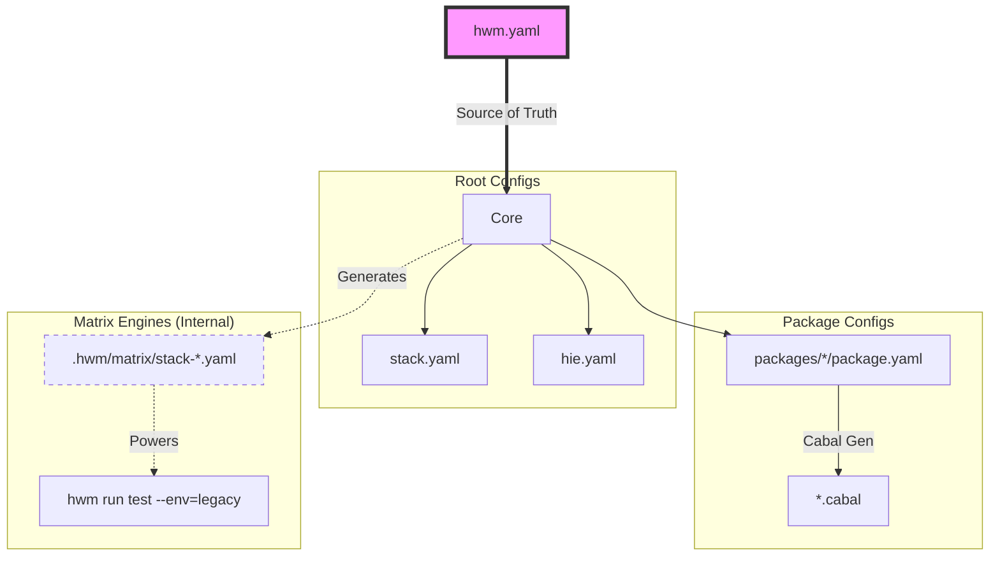

# HWM: Haskell Workspace Manager

> **Infrastructure-as-Code for your Haskell Workspaces.**

**HWM is not a replacement build tool.** It is the missing link that orchestrates the tools you already rely on (`stack`, `cabal`, `hls`), transforming them into a unified, declarative pipeline.

**Think of HWM as Terraform for your local repository.** Whether you are managing a single open-source library or a multi-package enterprise workspace, HWM ensures the state of your project files matches your declared intent across all environments.

HWM is an **active workspace maintainer** that helps you:

* **Manage & Validate:** Auto-generate and sync the configuration files your toolchain expects (`stack.yaml`, `package.yaml`, `hie.yaml`).
* **Derive & Verify:** Automatically calculate safe dependency bounds derived directly from your successful matrix builds.
* **Test Locally:** Run comprehensive matrix tests across multiple GHC versions right on your machine.
* **Release & Publish:** Streamline versioning, binary artifact generation, and Hackage publishing via simple workflow triggers.

---

### 💡 The Motivation: Streamlining Haskell Development

Haskell tooling is incredibly powerful. HWM was designed to help you scale that tooling effortlessly as your project grows, automating the repetitive tasks associated with workspace management:

1. **Seamless HLS Integration:** Adding a package or moving a module automatically updates your `hie.yaml`, keeping your Haskell Language Server responsive and accurate without manual intervention.
2. **Intelligent Build Matrices:** Testing against multiple GHC versions (e.g., Stable 9.6 and Legacy 8.10) is handled natively. Instead of discarding compatibility data after a CI run, HWM uses those successful builds to automatically derive and update your dependency bounds.
3. **Unified Dependency Management:** HWM acts as a centralized registry for your workspace, ensuring perfect alignment across all packages. You can easily guarantee that `core` and `api` are sharing the exact same dependency versions.
4. **Native Artifact Distribution:** HWM replaces custom deployment scripts with a clean, declarative pipeline for compressing, naming, and hashing binary artifacts for distribution.

### ✅ The Solution: A Single Source of Truth

You define your workspace architecture—structure, bounds, and build matrix—in a single file: `hwm.yaml`.
HWM handles the implementation details by generating the configuration files your standard tools expect.

<p align="center">

</p>

---

## 🧩 The "Missing Link" Architecture

HWM sits one layer above your toolchain, acting as the orchestrator for your project.



* **You write:** `hwm.yaml` (1 file).
* **HWM generates:** `stack.yaml`, `package.yaml`, `.cabal`, `hie.yaml`.
* **You run:** Standard `stack` or `cabal` commands (or use `hwm run` wrappers).

---

## 🟢 Quick Start

### Installation

```bash
stack install hwm
# or
cabal install hwm

```

### Zero-Config Onboarding

Already have a Stack project? Transform it into an HWM workspace in seconds.

```bash
# 1. Generate hwm.yaml from your existing stack.yaml
# HWM automatically discovers packages and infers dependencies
hwm init

# 2. Sync configuration and build
hwm sync
hwm run build

```

<p align="center">

</p>

## 🧪 Proven in Production

HWM was created to solve the orchestration needs of the **[Morpheus GraphQL](https://github.com/morpheusgraphql/morpheus-graphql)** ecosystem.

Today, it powers the entire Morpheus repository, smoothly managing:

* **15+ Packages:** Keeping `core`, `api`, and `client` synchronized.
* **Hybrid Matrices:** Testing `stable` (GHC 9.6) and `legacy` (GHC 8.10) environments side-by-side.
* **Unified Registry:** Maintaining a single source of truth for version bounds across the repository.

> **💡 Tip:** View the [live configuration here](https://github.com/morpheusgraphql/morpheus-graphql/blob/main/hwm.yaml) to see a full-scale example of HWM in action.

---

## 🛠️ Key Workflows

### 1. Registry & Dependency Management

The `registry` in `hwm.yaml` centralizes version bounds for your workspace.

**Smart Add:**
`hwm registry add` uses a "Sandwich" discovery logic to find the safest bounds by auditing your `legacy` (min) and `nightly` (max) snapshots.

```bash
# Add to a specific package
hwm registry add aeson libs/core

# Add to an entire group (all packages in the 'libs' directory)
hwm registry add servant libs

```

**Audit & Fix:**
Audit your bounds against actual Stackage snapshots, ensuring you only claim support for versions validated by your build matrix.

```bash
# Auto-update bounds in hwm.yaml to match tested snapshots
hwm registry audit --fix

```

<p align="center">

</p>

### 2. Workspace Scaffolding

HWM allows you to scaffold new packages natively and instantly wire them into your global configuration.

```bash
# Interactively or directly scaffold a new package in a specific group
hwm workspace add libs/core

```

<p align="center">

</p>

**What HWM does instantly:**

* Generates the package directory and `package.yaml`.
* Registers the new package under the correct group in `hwm.yaml`.
* Wires the package into `stack.yaml` for immediate building.
* Injects the package into `hie.yaml` for LSP support.

### 3. Matrix & Environment Management

Bring the power of CI matrices to your local development environment. Manage multiple GHC versions and resolvers seamlessly.

**Define Environments:**

```yaml
# hwm.yaml
environments:
  default: stable
  targets:
    stable:
      ghc: 9.6.3
      resolver: lts-22.6
    nightly:
      ghc: 9.10.1
      resolver: nightly-2024-05-22

```

**Manage Environments:**

* **Add:** `hwm environment add stable lts-24.25` (Validates against Stackage).
* **Switch:** `hwm environment set-default stable`.
* **List:** `hwm environment ls`.

**Run Your Matrix Locally:** Validate compatibility before pushing your code.

```bash
# Test across all defined environments (Stable, Nightly, etc.)
hwm run test --env=all

```

<p align="center">

</p>

### 4. Automated Release Workflows

By combining HWM with `relasy`, you can fully automate the release lifecycle with a single CI workflow trigger.

* **Auto-Versioning:** Calculate the next semantic version based on changes.
* **Auto-Publishing:** Upload synchronized packages to Hackage.

```bash
# Triggered by your CI pipeline:
hwm version minor   # Bumps versions atomically
hwm publish libs    # Uploads the entire workspace group

```

#### 📦 Artifact Pipeline

The `artifacts` pipeline is HWM's end-user distribution engine. It transforms raw binaries into optimized, compressed, and hashed distribution units, implemented entirely in Haskell for maximum portability.

##### Configuration

HWM uses a **Hybrid-Flat** structure, keeping targets and settings in the same namespace for clarity.

```yaml
release:
  artifacts:
    # Short-hand targets to build and package
    morpheus: libs/cli:morpheus

    # Custom target with specific formats and naming
    daemon:
      source: apps/daemon:hwm-daemon
      formats: [zip, tar.gz]
      ghc-options: -O2
      name-template: "{{binary}}-v{{version}}-{{os}}-{{arch}}"

```

##### Usage

```bash
# Local staging (wipes and fills .hwm/dist)
hwm release artifacts

# Publish to GitHub Releases with a masked upload URL
hwm release artifacts --gh-upload <upload_url>

```

---

## 🤖 Built for the AI Era

HWM natively condenses your workspace configuration into a format modern LLMs can easily parse.

* **Context Window Friendly:** Instead of providing an AI with 20+ `.cabal` files to explain your workspace architecture, you only need to provide a single `hwm.yaml` file.

---

## ⚖️ The Haskell Tooling Landscape

HWM is designed to offer a comfortable middle ground between standard manual setup and advanced orchestration frameworks, providing high automation with a gentle learning curve.

| Feature | Standard Setup | Nix / Bazel | 🚀 HWM |
| --- | --- | --- | --- |
| **Config Source** | Decentralized (Multiple files) | Centralized (`flake.nix`) | **Centralized (`hwm.yaml`)** |
| **Workspace Addition** | Manual Edits | Manual Edits | **✅ Auto-Discovery & Wiring** |
| **Release Pipelines** | Manual Scripts | Custom Scripts | **✅ Native Automation** |
| **Artifact Builds** | Bash Scripts | Requires Expertise | **✅ Native `.zip/.tar.gz**` |

---

## 🔮 Roadmap

HWM is actively evolving. While the core Workspace and Matrix engines are stable, we are actively developing the following operational features:

* **Professional Distribution (v0.1.0):** Automated Homebrew Formula generation and universal installers (`.deb`, `.rpm`).
* **Deep Nix Integration:** Generating `flake.nix` directly from `hwm.yaml`.
* **Smart Registry Pruning:** Automated detection of unused imports and missing `extra-deps`.

---

## 🧬 Status

HWM is currently in **Alpha**. We highly value your feedback! Please [open an issue](https://github.com/nalchevanidze/hwm/issues) if you encounter bugs, have feature suggestions, or want to share how you are using HWM.