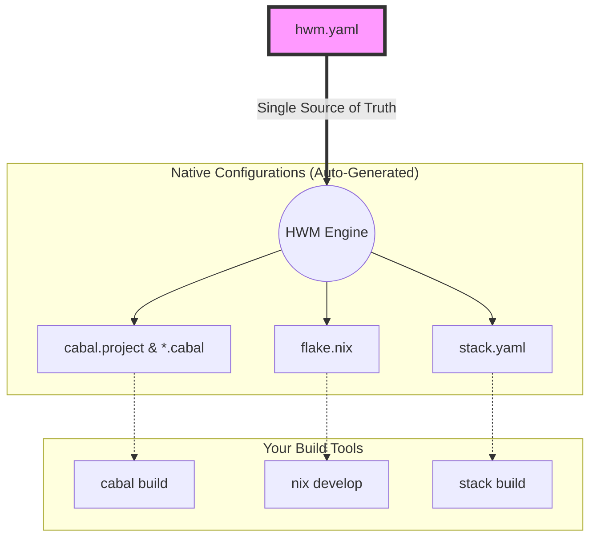
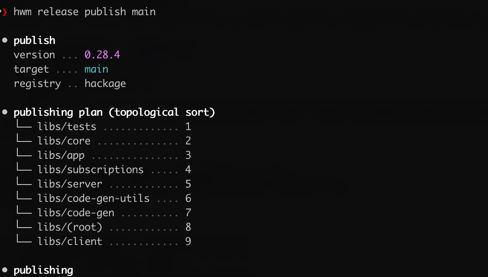

# HWM: Haskell Workspace Manager

> **Infrastructure-as-Code for your Haskell Workspaces.**

**HWM is a universal, build-tool agnostic orchestrator.** It is the missing link that unites the tools you already rely on (`cabal`, `stack`, `nix`, `hls`), transforming them into a single declarative pipeline.

**Think of HWM as Terraform for your local Haskell repository.** Whether you are a Nix purist, a Stack loyalist, or rely purely on Cabal, HWM ensures the state of your project files matches your declared intent across all environments.

HWM is an **active workspace maintainer** that provides:

* **The Universal Translator:** Write one `hwm.yaml`. HWM automatically derives and generates `cabal.project`, `stack.yaml`,`hie.yaml`, `flake.nix`, and `.cabal` files.
* **Zero Lock-in:** HWM materializes standard configuration files directly at your project root. You can uninstall HWM at any time, and your repository will still build perfectly using standard native tools.
* **Smart Bounds Synchronization:** Maintain a beautifully aligned, single-source-of-truth dependency registry. HWM automatically injects these bounds across your entire monorepo.
* **IDE Support:** Because standard files are generated at the root, Haskell Language Server (HLS) works instantly with zero configuration.

---

### ✅ The Solution: A Single Source of Truth

Define your workspace architecture in a single, visually clean file: `hwm.yaml`.
HWM handles the boilerplate and implementation details for whatever build system your team prefers.

<p align="center">

</p>

## 🧩 The Agnostic Architecture

HWM sits one layer above your toolchain. It separates your **workspace intent** from your **build implementation**.



---

## 🟢 Quick Start

### Installation

```bash
stack install hwm
# or
cabal install hwm

```

### Zero-Config Onboarding

Convert any existing repository into an HWM workspace in seconds.

```bash
# 1. Generate hwm.yaml. HWM automatically discovers packages and infers dependencies (for now only for stack based projects).
hwm init

# 2. Sync configuration (Generates cabal.project, stack.yaml, and package files)
hwm generate

# 3. Build using your favorite tool!
cabal build all

```

<p align="center">

</p>

## 🛠️ Key Workflows

### 1. The Global Registry & Dependency Sync

HWM uses a gorgeous, tabular dictionary to manage your dependencies. You define the bounds once in `hwm.yaml`, and HWM automatically injects them into every package in your monorepo.

```yaml
registry:
  Cabal:                '>= 3.8      && <= 3.16.1.0'
  aeson:                '>= 1.5.6.0  && <= 2.2.3.0'
  mtl:                  '>  2.0.0    && <  2.6.0'

```

**Audit & Fix:**
Audit your bounds against actual snapshots to ensure you only claim support for versions validated by your build matrix.

```bash
hwm registry audit --fix

```

<p align="center">

</p>

### 2. Smart Workspace Routing

Managing monorepos with dozens of packages is finally clean. HWM uses `prefix` grouping to elegantly decouple your internal structure from your globally unique Hackage package names.

```bash
# Interactively or directly scaffold a new package in a specific group
hwm workspace add libs
```

<p align="center">

</p>

```yaml
workspace:
  libs:
    prefix: morpheus-graphql
    members:
      - core
      - client
      - server

```

*When HWM generates your `cabal.project`, it automatically builds the exact relative paths (`morpheus-graphql-core`, `morpheus-graphql-client`), saving you from writing out bloated package names over and over.*

### 3. Multi-Mode Profiles

Bring the power of CI matrices to your local development environment. Define your environments purely by GHC version, and isolate tool-specific overrides in their own namespaces.

```yaml
environments:
  default: stable
  profiles:
    legacy:
      ghc: 8.10.7
      # Tool-specific escapes live cleanly under their own blocks
      stack:
        extra-deps:
          base-orphans: 0.8.1
          fastsum: 0.1.0.0
    stable:
      ghc: 9.6.3
      stack:
        extra-deps:
          fastsum: 0.1.1.1

```

**Run Your Matrix Locally (for now only for stack, nix will be suported):**

```bash
# Test across all defined environments (Stable, Legacy, etc.)
hwm test --env=all
```

<p align="center">

</p>

**Switching Environments:**

```bash
# Instantly overwrites the root configs (stack.yaml, cabal.project, flake.nix) 
# to match the 'legacy' GHC 8.10.7 profile.
hwm sync legacy 
```

### 4. Task Runner & Scripts

HWM includes a lightweight, pass-through task runner. Define simple aliases for your most common workflows directly in `hwm.yaml`.

```yaml
scripts:
  build: stack build
  clean: find . -name "*.cabal" -exec rm -rf {} \; && stack clean
  test:  stack test

```

Pass arguments seamlessly to your underlying tools:

```bash
# Translates to: stack test morpheus-graphql-core --fast
hwm run test -- morpheus-graphql-core --fast

```

### 5. Release & Distribution

HWM introduces **Release Trains**, decoupling your workspace structure from your distribution strategy.

#### 📦 Artifact Pipeline

Transform raw binaries into hashed, compressed distribution units.

```yaml
release:
  artifacts:
    hwm: libs/hwm:hwm

```

#### 🚢 Publication Trains

Define groups of packages to be published to Hackage together in topological order.

```yaml
release:
  publish:
    main:
      - libs

```

**Usage:**

```bash
# Bump version across the workspace
hwm version minor

# Build local binaries and hashes
hwm release artifacts 

# Push a specific train to Hackage
hwm release publish main

```

<p align="center">

</p>

## ⚖️ The Haskell Tooling Landscape

| Feature | Standard Setup | Nix / Bazel | 🚀 HWM |
| --- | --- | --- | --- |
| **Config Source** | Decentralized | Centralized | **Centralized (`hwm.yaml`)** |
| **Build System Support** | Single Tool | High Friction | **✅ Agnostic (Nix, Cabal, Stack)** |
| **Bound Management** | Manual Edits | Fixed Hashes | **✅ Smart Auto-Syncing** |
| **Lock-in** | High | Extreme | **✅ Zero Lock-in** |

## 🧬 Status

HWM is currently in **v0.1.0 (Beta)**. It was built to solve the orchestration needs of the **[Morpheus GraphQL](https://github.com/morpheusgraphql/morpheus-graphql)** ecosystem, where it successfully synchronizes 15+ packages across legacy and modern GHC profiles.

Your feedback is highly valued! Please [open an issue](https://github.com/nalchevanidze/hwm/issues) if you encounter bugs or want to share how you are using HWM.
