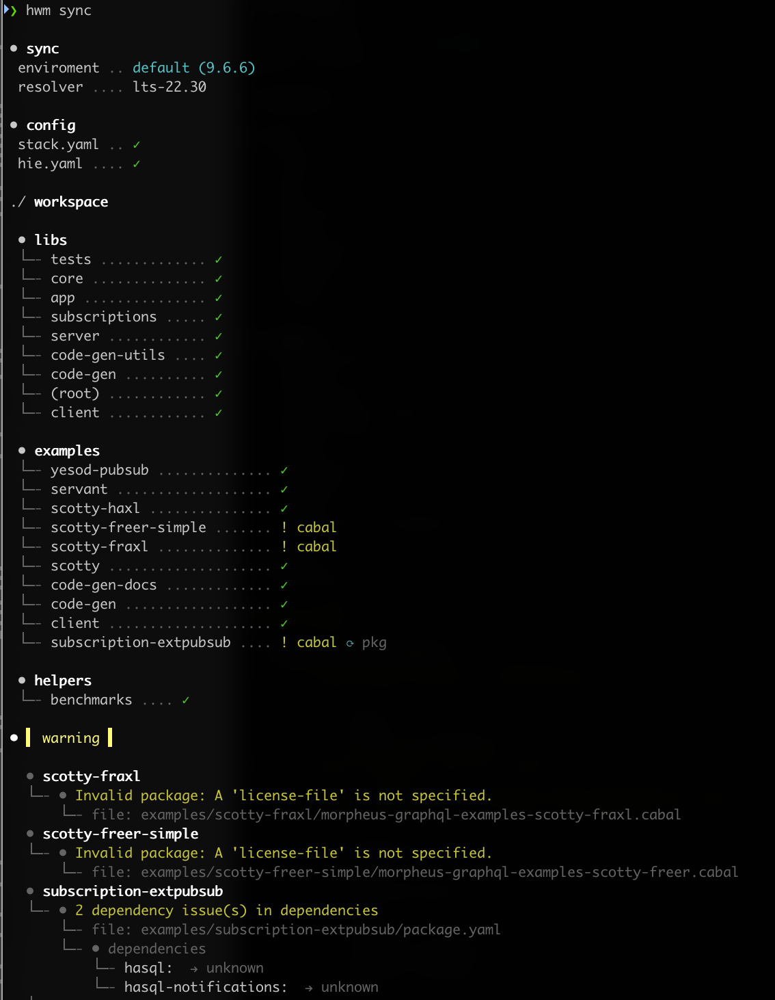

# HWM: Haskell Workspace Manager

**HWM is not a build tool.** It is the missing link that orchestrates the tools you already use.

Haskell has excellent build systems (`stack`, `cabal`, `nix`) and a powerful IDE (`hls`), but they don't talk to each other in a monorepo. HWM bridges this gap by acting as a **single source of truth**, automatically generating and synchronizing the configuration files those tools expect.

> [!IMPORTANT]
> **Project Status: Alpha** > HWM is in early, active development. While it currently powers the [Morpheus GraphQL](https://github.com/morpheusgraphql/morpheus-graphql) ecosystem, the API may evolve. We value your feedback—please [open an issue](https://github.com/nalchevanidze/hwm/issues) if you encounter bugs or have feature suggestions.

**Stop fighting your configuration. Start building your project.**

<p align="center">
  
</p>

---

## 🧩 The "Missing Link" Architecture

HWM sits one layer above your toolchain to ensure consistency without replacing standard workflows.

```text
[hwm.yaml] ───┬──► [stack.yaml]
              ├──► [hie.yaml]
              └──► [packages/*/package.yaml] ──► [*.cabal]

```

* **You write:** `hwm.yaml` (1 file) — *The source of truth.*
* **HWM generates:** `stack.yaml`, `package.yaml`, `.cabal`, `hie.yaml` (30+ files) — *The noise you shouldn't have to manage.*
* **You run:** Standard `stack` or `cabal` commands (or use `hwm run` wrappers).

---

## 💥 The Problem

In a typical Haskell monorepo (like `morpheus-graphql`), maintaining consistency is a full-time job:

1. **Dependency Drift:** "Why does `core` use `aeson-2.0` but `api` uses `aeson-1.5`?"
2. **Matrix Complexity:** Testing GHC 8.10, 9.6, and 9.10 requires maintaining three separate `stack.yaml` files.
3. **Broken IDEs:** Adding a module often breaks HLS until you manually update a fragile `hie.yaml`.
4. **Release Friction:** Releasing a monorepo requires manually bumping versions, checking bounds, and uploading packages in the correct order.

---

## ✅ The Solution

You define the "what" (structure, bounds, matrix) in `hwm.yaml`. HWM handles the "how."

### 1. Centralized Config (`hwm.yaml`)

```yaml
name: my-project
version: 0.1.0

workspace:
  - name: libs
    prefix: my-app
    members: [core, api, client]

# Global version bounds (Shared across all 3 packages)
registry:
  - aeson >= 2.0 && < 3.0
  - text  >= 2.0 && < 3.0

# Build matrix (Generates .hwm/matrix/stack-*.yaml per environment)
matrix:
  default-environment: stable
  environments:
    - { name: stable, ghc: 9.6.3, resolver: lts-22.6 }
    # Note: Nightly resolvers must use the date-stamped format
    - { name: nightly, ghc: 9.10.1, resolver: nightly-2024-05-22 } 

```

### 2. Synchronization (`hwm sync`)

One command regenerates the entire toolchain configuration, ensuring your IDE and build tools are always in sync with your manifest.

> **💡 Health Checks:** Run `hwm status` at any time. It will flag generated files with a ⚠️ if they have drifted from your `hwm.yaml` configuration.

<p align="center">

</p>

---

## ⚡️ Unified CI/CD: Stop Debugging CI in CI

In most projects, the Build Matrix only exists in the cloud (`.github/workflows`). HWM brings that matrix down to your machine.

**The HWM Way:** Run your entire matrix locally. Catch failures on "Legacy GHC" before you push.

<p align="center">

</p>

* **The Old Way:** Push → Wait 15m → ❌ Failure on GHC 8.10 → Fix → Push again.
* **The New Way:** `hwm run test --env=all` → ❌ Legacy fails → Fix → ✅ Pass → Push once.

Because HWM handles the matrix logic, your CI configuration becomes trivial. You no longer need complex YAML strategies or matrix definitions in GitHub Actions.

---

## 🤖 Built for the AI Era

HWM transforms your monorepo into a format LLMs can actually understand.

* **Context Window Friendly:** Instead of pasting 20+ `.cabal` files to give an AI context, paste one `hwm.yaml`.
* **Safe Refactoring:** Ask your AI agent to "Upgrade dependencies to GHC 9.10" by editing the `matrix` in `hwm.yaml`. HWM handles the dangerous work of propagating those changes to 50+ files deterministically.

---

## 🟢 Quick Start

### Installation

```bash
stack install hwm
# or
cabal install hwm

```

### Zero-Config Onboarding

### Zero-Config Onboarding

Already have a Stack project? Transform it into an HWM workspace in seconds. 
HWM automatically detects your packages, infers dependencies, and generates the configuration.

<p align="center">
  
</p>

```bash
# 1. Generate hwm.yaml from your existing stack.yaml
hwm init

# 2. Sync and build
hwm sync
hwm run build

```

✨ **That's it!** HWM scans your existing configuration, discovers packages, infers dependencies, and creates `hwm.yaml`. Your project structure stays exactly the same.

> **Already have `hwm.yaml`?** Use `hwm init --force` to regenerate from your current Stack config.

---

## 🛠️ Key Workflows

### 📦 Automated Dependency Management

Replace external bots with a built-in command that understands your workspace.

```bash
# Check Hackage for updates to your registry
hwm outdated

# Auto-update bounds in hwm.yaml and sync all packages
hwm outdated --fix

```

### 🚀 Synchronized Releases

Eliminate release anxiety. HWM ensures version numbers and bounds are consistent before uploading.

```bash
# Atomically bump version to 0.2.0 across all packages
hwm version minor

# Publish the 'libs' group to Hackage
hwm publish libs

```

---

## ⚖️ Comparison

Most Haskell teams are stuck between "Manual Chaos" and "Nix Overkill." HWM provides a middle ground. Even if you use Nix for builds, HWM manages the source files that Nix reads.

| Feature | 🐢 Manual Config | ❄️ Nix / Bazel | 🚀 HWM |
| --- | --- | --- | --- |
| **Config Source** | Decentralized (30+ files) | Centralized (`flake.nix`) | **Centralized (`hwm.yaml`)** |
| **Primary Role** | Build Tool | Build & Deployment | **Workspace Manager** |
| **Atomic Versioning** | ❌ Manual (File by file) | ❌ Manual (Edit .cabal) | **✅ One Command (`hwm version`)** |
| **Publishing** | ❌ Manual `cabal upload` | ❌ Custom CI Scripts | **✅ Atomic `hwm publish**` |
| **Dependency Sync** | ❌ Manual (Error-prone) | ⚠️ Pinned (Lockfile) | **✅ Automatic Registry** |
| **Matrix Scripts** | ❌ Manual Context Switch | ⚠️ Complex Shells | **✅ Parallel (`hwm run --env=all`)** |
| **IDE Support** | ⚠️ Often Broken | ⚠️ Requires Plugins | **✅ Auto-Generated (`hie.yaml`)** |

---

## 📚 Documentation

Detailed specifications and internal guides can be found in `docs/`:

* **[Feature Specification](https://www.google.com/search?q=docs/spec.md)** – The complete Public API, configuration schema (`hwm.yaml`), and CLI behavior.
* **[Architecture](https://www.google.com/search?q=docs/architecture.md)** – Internal design principles, data flow, and module structure.
* **[Roadmap](https://www.google.com/search?q=docs/roadmap.md)** – Future plans and upcoming features.

---

## 🧬 Origin

HWM was born out of necessity to manage the [Morpheus GraphQL](https://github.com/morpheusgraphql/morpheus-graphql) ecosystem with 15+ packages across multiple GHC versions.
