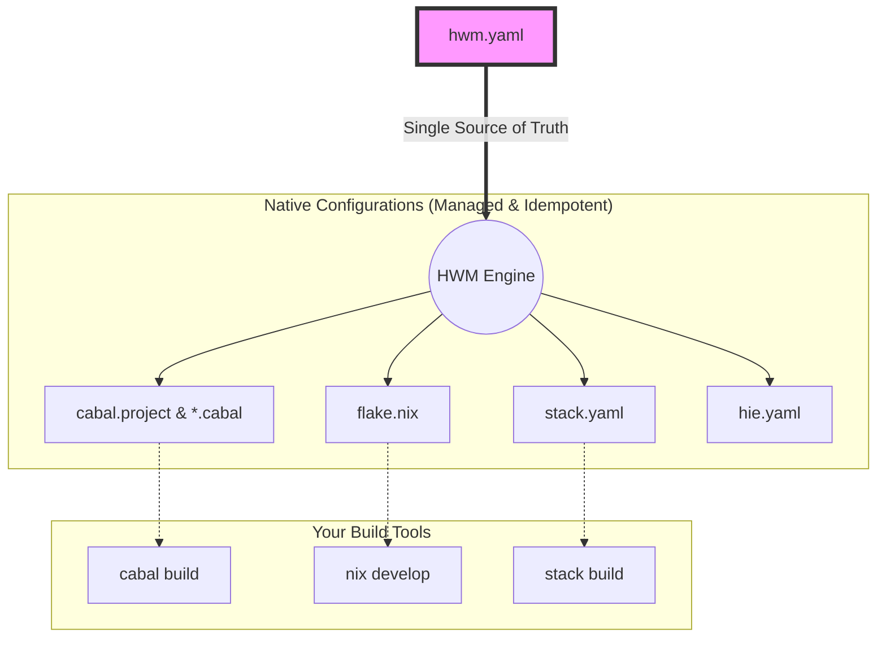

# HWM: Haskell Workspace Manager

> **Infrastructure-as-Code for your Haskell Workspaces.**

**HWM is a build-tool orchestration layer for Haskell workspaces.** It connects tools you already rely on (`cabal`, `stack`, `nix`, `hls`) behind a single declarative config, with some current capability gaps documented below.

**Think of HWM as Terraform for your local Haskell repository.** Whether you are a Nix purist, a Stack loyalist, or rely purely on Cabal, HWM ensures the state of your project files matches your declared intent across all environments.

HWM is an **active workspace maintainer** that provides:

- **The Universal Translator:** Write one `hwm.yaml`. HWM automatically derives and generates `cabal.project`, `stack.yaml`, `hie.yaml`, `flake.nix`, and `.cabal` files.
- **Zero Lock-in:** HWM materializes standard configuration files directly at your project root. You can uninstall HWM at any time, and your repository will still build perfectly using standard native tools.
- **Smart Bounds Synchronization:** Maintain a beautifully aligned, single-source-of-truth dependency registry. HWM automatically injects these bounds across your entire monorepo.
- **IDE Config Generation:** HWM generates `hie.yaml` at the project root when enabled. _Current implementation note: cradle generation is stack-oriented and not yet fully builder/profile-aware._
- **Flexible Toolchain Toggles(v0.2.0):** You are in total control. Explicitly enable or disable `stack`, `nix` globally, or toggle them on a per-profile basis.

<p align="center">

</p>

## 🧩 The Agnostic Architecture

HWM sits one layer above your toolchain. It separates your **workspace intent** from your **build implementation**.


```mermaid
graph TD
    HWM[hwm.yaml] ===>|Single Source of Truth| Engine((HWM Engine))

    subgraph "Native Configurations (Managed & Idempotent)"
    Engine --> Cabal[cabal.project & *.cabal]
    Engine --> Nix[flake.nix]
    Engine --> Stack[stack.yaml]
    Engine --> HLS[hie.yaml]
    end

    subgraph "Your Build Tools"
    Cabal -.-> RunCabal[cabal build]
    Nix -.-> RunNix[nix develop]
    Stack -.-> RunStack[stack build]
    end

    style HWM fill:#f9f,stroke:#333,stroke-width:4px

```

---

## 🟢 Quick Start

### Installation

```bash
cabal install hwm
```

### Zero-Config Onboarding

Convert any existing repository into an HWM workspace in seconds.

```bash
# 1. Generate hwm.yaml. HWM automatically discovers packages and infers dependencies.
hwm init

# 2. Sync configuration (Generates cabal.project, stack.yaml, flake.nix, hie.yaml)
hwm sync

# 3. View the visual dashboard of your workspace
hwm status

```

<p align="center">

</p>

## ⚠️ Current Behavior Notes (Transparency)

- **Unknown command fallback:** `hwm <token>` is treated as `hwm run <token>` if `<token>` is not a top-level command.
  - This means command typos can appear as script lookup failures.
- **Script execution model:** `hwm run` executes scripts via shell (`/bin/sh -c ...`) and forwards extra args as positional parameters.
- **IDE generation caveat:** generated `hie.yaml` is currently stack-cradle oriented.
- **Generated files are ephemeral:** `hwm sync` rewrites generated files (`cabal.project`, `stack.yaml`, `flake.nix`, `hie.yaml`) according to `hwm.yaml`.
- **Nix delivery gap (current):** install/publish workflows with `nix` and `nix/cabal` are not fully supported yet and may fail with explicit errors.

## 🛠️ Key Workflows

### 1. The Global Registry & Dependency Sync

HWM uses a gorgeous, tabular dictionary to manage your dependencies. You define the bounds once in `hwm.yaml`, and HWM automatically injects them into every package in your monorepo.

```yaml
registry:
  Cabal: ">= 3.8      && <= 3.16.1.0"
  aeson: ">= 1.5.6.0  && <= 2.2.3.0"
  mtl: ">  2.0.0    && <  2.6.0"
```

**Audit & Fix:**
Audit your bounds against actual snapshots to ensure you only claim support for versions validated by your build matrix.

```bash
hwm registry audit --fix

```

<p align="center">

</p>

### 2. Smart Workspace Routing

Managing monorepos with dozens of packages is finally clean. HWM uses `prefix` grouping to elegantly decouple your internal structure from your globally unique Hackage package names.

```bash
# 1) Create a workspace group
hwm workspace add libs

# 2) Scaffold a package inside the group
hwm workspace add libs/core
```

<p align="center">

</p>

```yaml
workspace:
  libs:
    prefix: morpheus-graphql
    members:
      - core
      - client
      - server
```

_When HWM generates your configs, it automatically builds the exact relative paths (`morpheus-graphql-core`), saving you from writing out bloated package names over and over._

### 3. Environments, Builders & CI Profiles

Bring the power of CI matrices directly into your local workspace. HWM allows you to define logical **environments** that map to specific GHC versions, toolchain toggles, and specific builders (`stack`, `cabal`, or `nix`).

Instead of writing complex bash routing in GitHub Actions or juggling multiple config files locally, you define your targets exactly once. HWM treats these files (`stack.yaml`, `cabal.project`, `flake.nix`, `hie.yaml`) as **ephemeral generators**—artifacts of your current profile.

```yaml
environments:
  # Global defaults for the workspace
  builder: stack 
  default: stable
  nix: true   # Auto-generates flake.nix on 'hwm sync'
  stack: true # Auto-generates stack.yaml on 'hwm sync'
  hie: true   # Auto-generates hie.yaml on 'hwm sync'

  profiles:
    legacy:
      ghc: 8.10.7
      # Override: Disable HLS for old GHCs and omit from flake.nix
      hie: false 
      stack:
        extra-deps:
          base-orphans: 0.8.1
          fastsum: 0.1.0.0

    stable:
      ghc: 9.6.3
      builder: nix/cabal # Uses Nix to provide the environment and Cabal to build

    # Purpose-built CI profiles
    ci-windows:
      ghc: 9.6.3
      builder: cabal
      nix: false # Excluded from flake.nix; uses pure Cabal on Windows
    
    ci-nix:
      ghc: 9.6.3
      builder: nix

    ci-mixed:
      ghc: 9.6.3
      builder: nix/cabal # Uses Nix to provide the environment and Cabal to build
```

**Seamless CI Integration:**
By defining profiles like `ci-nix` and `ci-windows`, your GitHub Actions workflow becomes incredibly simple. You just tell HWM to sync the environment, and it instantly pivots the workspace to use the correct underlying toolchain.

```bash
hwm sync ci-mixed
hwm build # Executes via 'nix develop --command cabal build'

# On Ubuntu/macOS runners:
hwm sync ci-nix
hwm build # Executes 'nix build --no-link .#env-ciNix-all' where 'env-ciNix-all' is a synthetic package that depends on all packages in the workspace, for enviroment 'ci-nix' with ghc 9.6.3.

# On Windows runners:
hwm sync ci-windows
hwm build # Executes via 'cabal build'
```

**Run Your Matrix Locally:**
Avoid "CI Ping-Pong" by running tests across all defined environments locally. HWM handles the context switching between builders (Stack vs. Cabal vs. Nix) automatically.

```bash
# Runs the test suite across every defined profile
hwm test --env=all
```

<p align="center">

</p>

**Manual Environment & IDE Switching:**
When you run `hwm sync`, HWM updates build files and (when `hie` is enabled) rewrites `hie.yaml`.

```bash
# Instantly overwrites stack.yaml, flake.nix, and hie.yaml for GHC 8.10
hwm sync legacy
```

### 4. Task Runner & Scripts

HWM includes a lightweight, pass-through task runner. Define simple aliases for your most common workflows directly in `hwm.yaml`.

```yaml
scripts:
  format: sh scripts/format.sh
  lint: hlint .
  test: hwm test --fast

```

Argument forwarding note:

`hwm run <script> [ARGS...]` passes extra args to the shell invocation as positional parameters.
If your script needs them, handle them explicitly in the script command.


### 5. Release & Distribution

HWM introduces **Release Trains**, a high-integrity system for decoupling workspace structure from distribution strategy while ensuring topological correctness.

#### 📦 Artifact Pipeline

Transform raw binaries into hashed, compressed distribution units using your preferred engine. HWM ensures every artifact is strictly validated before the publication phase begins.

NOTE: publishing/install flows are currently not supported for `nix` and `nix/cabal` builders.
If attempted, HWM will fail with an explicit error.

```yaml
environments:
  builder: stack # or nix or cabal
release:
  artifacts:
    hwm: libs/_root_:hwm

```

#### 🚢 Publication Trains

Define groups of packages to be published to Hackage. HWM enforces a **topological sort**, ensuring "core" dependencies are published before the packages that rely on them.

```yaml
release:
  publish:
    main:
      - libs

```

**Usage:**

```bash
# Bump version across the workspace
hwm version minor

# Build local binaries and hashes with builder of choice
hwm release artifacts --builder=cabal

# Push a train to Hackage (Requires HACKAGE_AUTH_TOKEN in environment with a valid API token)
hwm release publish main
```


<p align="center">

</p>

## ⚖️ The Haskell Tooling Landscape

| Feature                  | Standard Setup    | Nix / Bazel   | 🚀 HWM v0.2.0                       |
| ------------------------ | ----------------- | ------------- | ----------------------------------- |
| **Config Source**        | Decentralized     | Centralized   | **Centralized (`hwm.yaml`)**        |
| **Build System Support** | Single Tool       | High Friction | **✅ Agnostic (Nix, Cabal, Stack)** |
| **Idempotency**          | Manual Edits      | Varies        | **✅ Silent Writes (mtime-safe)**   |
| **IDE Setup**            | Manual `hie.yaml` | Complex       | **✅ Auto-Generated (Smart)**       |
| **Lock-in**              | High              | Extreme       | **✅ Zero Lock-in**                 |

## 🧬 Status

HWM is currently in **v0.2.0 (Beta)**. It was built to solve the orchestration needs of the **[Morpheus GraphQL](https://github.com/morpheusgraphql/morpheus-graphql)** ecosystem, where it successfully synchronizes 15+ packages across legacy and modern GHC profiles.

Your feedback is highly valued! Please [open an issue](https://github.com/nalchevanidze/hwm/issues) if you encounter bugs or want to share how you are using HWM.
